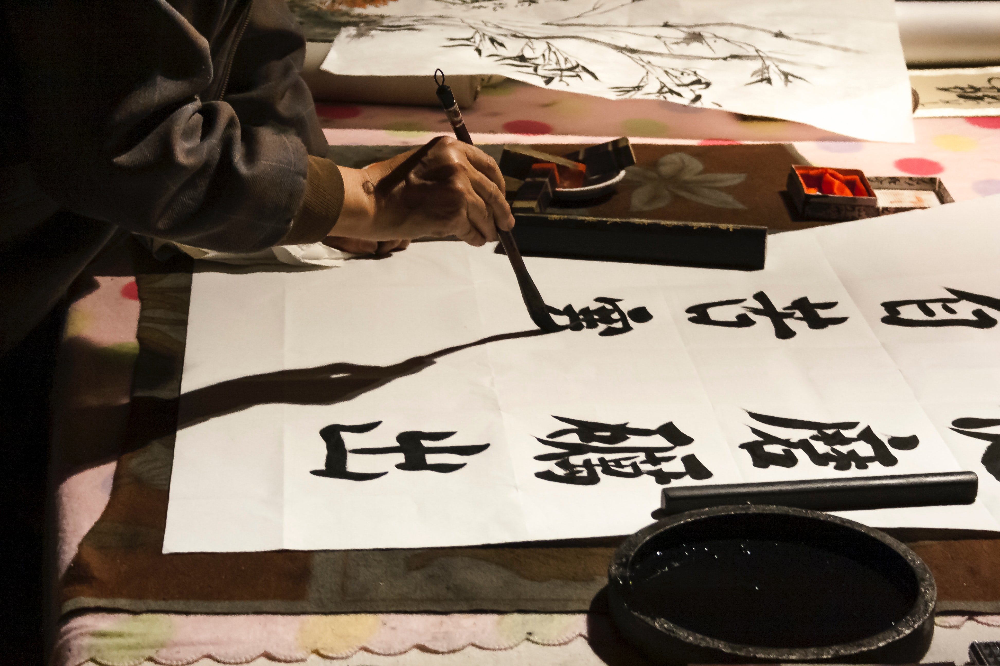

import { Japanese } from "../../components/common"

It’s been just over a year since I started learning Japanese so I thought it was
a good time to stop, reflect over my journey and consider what I’ve learnt. I
started on 19th April 2020 and since then I’ve dedicated 1,378 hours to studying
(according to my [timer app](https://productivitychallengetimer.com/)). That’s
just over 25 hours a week, quite a lot on top of a full time job. In this post,
I will try to justify how I spent that much time on a hobby (neglecting
everything else in my life) as well as point people to the resources I used.

## How did I learn Japanese?

### Setting goals

I’m one of those cool kids that likes to set goals for myself even outside of
work. So in order to take learning Japanese seriously, I set some goals up
front. A lot of these were around passing a set of exams called the
[JLPT (Japanese-Language Proficiency Test)](https://www.jlpt.jp/e/about/index.html).
Unfortunately, I couldn’t take these in person (because of the whole COVID
thing) but I did take some mock papers on the dates I set in advance. Happily, I
"passed" N5 with a result of 91% in July, N4 with 91% in August and N3 with 80%
in December. I’m planning to take a mock N2 test on July 4th, the day the exam
would have taken place in London if it wasn’t cancelled. And hopefully, I’ll be
able to take the real thing in December and have a shiny certificate to show for
it (plus, validate all the work I put in).

The other goal I set for myself way back in April 2020 was to read and finish
Harry Potter and the Philosopher’s Stone, the Japanese version, by the end of
the year. Frankly, it took me ages to do so, but I did finish the book and
[wrote about it another blog post](/blog/i-read-my-first-book-in-japanese/) to
celebrate the occassion.

### Learning how to learn

At the very beginning, I spent a good deal of time researching how to learn
Japanese. Being a spoiled native English speaker, my main exposure to formal
language learning was (not really) learning German at school. My first baby
step, therefore, was to learn how to learn. On one of my internet explorations,
I found a 177 page
[Google Doc](https://docs.google.com/document/d/10bRzVblKVOsQJjTc2PIi1Gbj_LrsJCkMkh0SutXCZdI/edit)
that detailed the author’s experience learning Japanese and their recommended
approach. It’s packed with information so I suggest checking it out if you want
to learn Japanese and don’t know where to start.

After ~~reading~~ skimming over the document, I started to reframe what learning
Japanese actually meant. Before, I had this idea that I would be training a
particular skill (the ability to Japanese?) But it turns out language
acquisition is a bit more complex than that and includes multiple skills. There
are passive skills, such as listening and reading, which determine how well you
can understand Japanese in different settings. As well as active skills,
speaking and writing, which determine how well you can communciate. Underpinning
all these skills are the building blocks of the language, grammar and
vocabulary.

Structuring my language learning around these building blocks and skills allowed
me to allocate my time most effectively. Early on, I decided to prioritise
listening and reading over speaking and writing. I knew it would be much easier
to find Japanese audio and text than it would be to befriend people who could
speak the language, something I wasn’t yet confident enough to do. I could also
shift my focus depending on the parts of the language I was weakest at. This was
an ongoing analysis. When reading a book, I might notice that I am spending more
time looking up kanji than I am vocab or grammar. I might also find that I
stuggle to understand a sentence when it’s written down but can comprehend it
instantly when it’s spoken in the audiobook. These kind of observations helped
refine my study plan so that I could continue to learn effectively.

### Kanji and vocabulary

I spent a significant chunk (nearly 600 hours) of my time learning kanji and
vocabulary. It was the area I spent the most time in because kanji is simply the
hardest part of the language, and one where I didn’t have a head start in. There
are thousands of kanji characters and it’s one of the reasons why Japanese is
considered
[the hardest language for a native English speaker to learn](https://effectivelanguagelearning.com/language-guide/language-difficulty/).

I researched a few ways I could learn kanji and ultimately decided on
[WaniKani](https://www.wanikani.com/). It’s a web app that teaches kanji and
vocabulary using mnemonics and spaced repetition. It’s quite pricey ($299 for a
lifetime subscription) but, unlike free resources, everything is laid out for
you. All you need to do is turn up, learn some stuff and try to progress to the
next level. As you go through the levels and finally take down the boss at level
60 (the boss _might_ be made-up), you’ll have learned over 2000 kanji. You’ll
have also learned 8000 supplementary vocabulary containing the kanji you
learned.

I actually reached level 60 a week ago! I still have a ton of items to review
but have otherwise completed the course. Having just over 2000 kanji floating
around my brain is a massive help when I want to read practically anything.
There are still quite a lot of characters that I encounter in the wild that I
haven’t properly met yet. These I am confident I will get to know over time as I
now have a knack for learning kanji.

### Grammar

Compared to kanji and vocabulary, I didn’t spend a significant amount of time
studying grammar. In fact I only spent 90 hours doing so. Thankfully, I already
had an intuitive understanding of common grammar patterns that was ingrained
from when I was a child. So when I struggled to grasp the meaning of a sentence,
very rarely was it because of my lack of familiarity with the grammar. Instead,
it was usually because I had no idea what the kanji characters were or what the
vocabulary meant.

When I did study grammar, I used the very popular
[Genki I](https://www.goodreads.com/book/show/10833581-genki-i),
[Genki II](https://www.goodreads.com/book/show/12899848-genki-ii) and
[Tobira](https://www.goodreads.com/book/show/6618452-tobira?from_search=true&from_srp=true&qid=Uco4yDM1AR&rank=1)
textbooks (as that is what the internet suggested). I went through these
textbooks one after the other; they roughly teach N5, N4 and N3 level grammar
respectively. Up next, I have the <Japanese>新完全マスター文法 日本語能力試験
N2</Japanese>
([New Kanzen Master Grammar JLPT N2](https://www.goodreads.com/book/show/25617186-n2))
textbook which I will dive into soon.

### Listening

I spent around 320 hours listening to Japanese in the past year. In the
beginning, it was a skill far more advanced than my non-existent reading
ability. So it was a way to immerse myself in Japanese without having to do any
studying beforehand.

I started with a
[Let's Play series on Stardew Valley](https://www.youtube.com/watch?v=Q1QpZdCHHoA&list=PLDKkKPYyoB3ANuP72zvJClW2zHcpF5prO).
It’s a game I’ve spent hundreds of hours on so I could pick up a lot of words
just from the context. It was nice to be able to wind down in the evening and
feel like I’m studying when all I’m doing is watching someone play Stardew
Valley. I also listened to a lot of
['Let’s learn Japanese from small talk!' (podcast)](https://www.stitcher.com/show/small-talk-in-japanese)
when I was cooking and watched a bunch of anime when I was eating. (As an aside,
[AnimeFeminist](https://www.animefeminist.com/anifem-recommends/) is a great
place to discover feminist-friendly anime, if you care about that sort of
thing.) I even rewatched all of The Good Place with Japanese audio — amusing and
educational, highly recommend.

### Reading

I spent a similar amount of time reading (314 hours) as I did listening. I’m
still better at understanding spoken Japanese than I am written Japanese but I
have made huge strides in the past year. At the start, I could barely read
hiragana and katakana (kanji isn’t the only writing system, just the hardest)
and would struggle to read a [NHK Easy News](https://www3.nhk.or.jp/news/easy/)
article. Now, I’m able to read whole books in Japanese and read my latest, the
third in the Kiki’s Delivery Service series, at 68% of audiobook speed.

I’m still planning to read two books a month this year. I’ve read four so far,
so am a bit behind. But I’m hoping to catch up as my reading speed improves. I
also have a backlog of video games I’d like to get through at some point which
will definitely challenge my reading ability.

### Speaking

Pretty much the only person I speak to in Japanese is my mum. I’ve spent 27
hours speaking Japanese in the past year so that’s 27 hours on the phone with my
mum. I’ve definitely improved since I started, but I think that’s mostly down to
how much time I’ve spent in the other areas of my study. Going forward, I might
try to find a tutor on [italki](https://www.italki.com/?hl=en) and even attempt
to chat to strangers on [HelloTalk](https://www.hellotalk.com/?lang=en),
whenever I pluck up the courage to do so.

### Writing

Finally, writing is the skill that I’ve dedicated the least amount of time to
(15 hours). I had planned to [write a journal entry every day](/journal/) but I
kind of fell out of habit on that one. At some point I will pick it up again but
it is hard. As much as I can comprehend a fair amount when I’m listening or
reading, being able to produce coherent Japanese on the fly is something I need
more practice at. In terms of handwriting Japanese, I haven’t spent any time on
it at all. Most of my life is spent on the computer and I barely handwrite in
English anyway. So it’s on the bottom of my list of priorities at the moment.

## Am I fluent?

The most common question I get when I tell people I’m learning Japanese is, "Are
you fluent?" It seems like a fair question to ask, especially given the amount
of time I’ve spent on it. A quick Google search for "how long does it take to be
fluent in a language" will give top answers in the range of 200 to 720 hours.
So, given I’ve spent 1,328 hours studying Japanese, surely I should be fluent
many times over... Right?

> No.

I’m going to dedicate the next few paragraphs to make my case. Hopefully, this
will set expectations for new learners for what’s possible in a short space of
time. But more importantly, my pride is at stake here and I want to prove to
myself that I’m not a horrendously slow learner.

### What is fluency?

It’s time to question the question. 'Fluency' is quite an abstract concept and
open to very different interpretations. Firstly, there’s the question of which
skills you need to acquire to say you’re fluent. For example, you might think
'fluency' only refers to your ability to verbally communicate . This makes sense
because for a long time the majority of the population were illiterate but were
still viewed as 'fluent' in their native language. On the other hand, not
knowing how to read or write in your target language does feel a bit incomplete.
There are also other aspects to communicating successfully beyond language, such
as gestures and cultural etiquette.

Secondly, there’s the question of what mastery you need to attain to be classed
as 'fluent'. Conversational fluency, in which you are able to converse on
everyday topics (with room for mistakes), is a far cry from being able to
eloquently express yourself on a range of complex topics.

I would argue that the term 'fluency' isn’t a very helpful term for measuring
language acquistion at all. It’s too ambiguous and highly contextual. You might
have a near faultless exchange with a native speaker about the weather, which
convinces them that you’re fluent. But that evening, the waiter swaps your
Japanese menu for an English one after seeing the utter panic on your face at
the indecipherable squiggles. In these situations, being perceived as 'fluent'
is a fleeting state that you can gain or lose depending on the context and who
you’re with.

So a more accurate (and more annoying) answer to the question, "Are you fluent?"
is, "It depends."

### A better measure

Instead of this intangible idea of 'fluency', I like to compare my Japanese to
my English. This gives me a good measure of how far I’ve progressed and how far
there is to go. I don’t expect to ever be as proficient with Japanese as I am in
my native language, I already have 25 years of practice with English after all.
But, setting the bar at where my native language stands does make my North Star
a lot less ambiguous. It also exposes the sheer amount of time learning a new
language takes, which is often glossed over or outright fabricated by marketers
trying to sell you something.

In the end, I can feel good about reading a book in Japanese or having a
conversation with my mum but I don’t delude myself into thinking, "That’s it! I
have mastered the language now." If I had tried to read the same sorts of things
I do in English, such as technical books, or talk about the same sorts of things
I do in English, such as philosophy or politics, I wouldn’t know where to start.
Even writing this same blog post in Japanese seems like an impossible feat or,
at least, several years away.

## What else have I learned?

One of the interesting things I have found about the past year is that I haven’t
just learned Japanese. I have also developed a lot of other weird quirks as a
by-product.

### Resilience

It’s worth saying that I picked up Japanese during the pandemic and I truly
believe it’s what helped me not only get through it but have one of my best
years. Someone recently said to me that developing resilience is a lot about
having a clear direction of where you want to go, even in the midst of chaos.
And that really spoke to what learning Japanese has given me. I set clear long
term goals of what I wanted to achieve and luckily, I have been able to focus on
that even as the world fell apart around me.

### Time management

My time management and discipline is way better than I ever thought it could be.
I have been spending pretty much most of my free time studying, more than I ever
did at university (when I didn’t even have a job to distract me). One of the
things that helped me was using my
[timer app](https://productivitychallengetimer.com/) to time each study session.
The app gives you a superficial rank depending on how much time you’ve clocked
in during the week. As trivial as it sounds, the idea of gaining or losing a
rank often pushed me to study, even on days when I was more reluctant to do so.

### Enjoyment

To my surprise, I found that I actually enjoy studying — the slow grind to get
marginally better every day. At the beginning, I set my sights on the end goal,
getting good at Japanese, and never considered that I would enjoy the journey
itself. In particular, I’ve got a lot of fun out of gamifying the process and
tracking my progress across various metrics. I also love that I am able to peep
into another world and consume untranslated materials, like news articles and
books, that are inaccessible to most of the world’s population.

All in all, I highly recommend learning a new language if you’re interested! In
any case, it’s a good way to challenge your brain and
[delay the onset of Alzheimer’s and Dementia](http://glasgowmemoryclinic.com/news/learning-language-prevent-dementia/).
