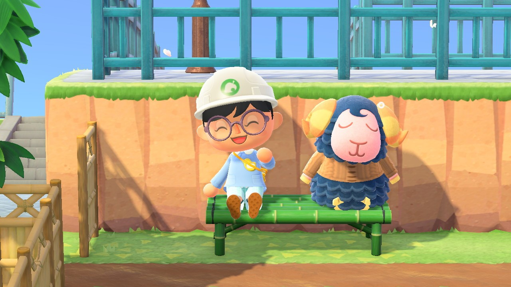
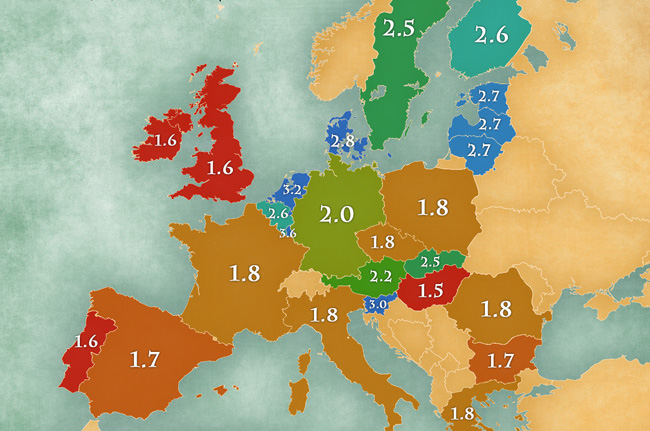
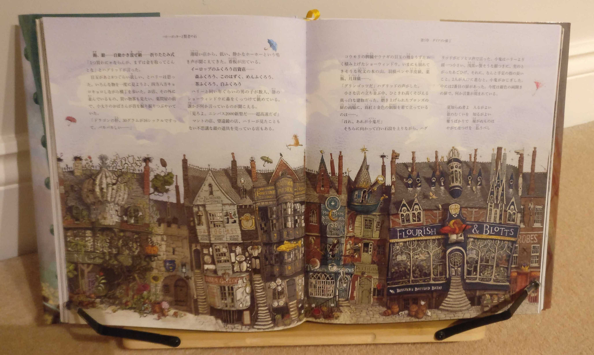
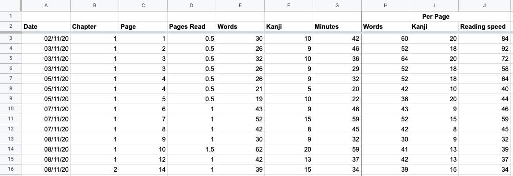
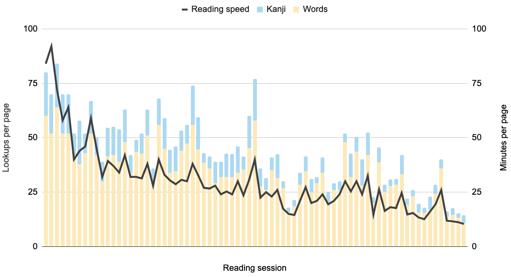
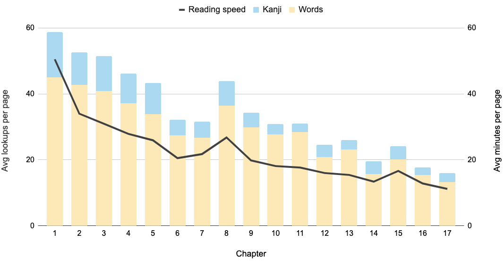

Last year, I embarked on a journey to learn Japanese. I set myself an objective
to read Harry Potter and the Philosopher’s Stone (or  ハリ
ー・ポッターと賢者の石) by the end
of 2020. Two weeks ago, I accomplished this goal. In this post, I describe my
journey so far, approach to reading, and will present some fun stats and graphs
I recorded along the way.

Back in April, I suddenly found myself with a lot more time on my hands. The UK
was under strict lockdown. Not having to commute to work, socialise, or even go
outside at all, meant I gained several hours a day. At first, I spent all that
extra time playing Animal Crossing (<small>200 hours within the first month of
its release</small>). On my third attempt to landscape my Animal Crossing
island, I stopped. I was wasting an opportunity. If there was any time to
reignite my interest in learning Japanese, this was it.

My previous attempts to study the language were largely unsuccessful. I dabbled
a bit with language learning apps and lost interest quite quickly. Even though I
am fortunate enough to understand a fair amount of Japanese already (thanks,
mum), I just didn’t have much experience or confidence in being able to acquire
a new language. My time learning French and German at school taught me that I
could rote-learn vocabulary lists, memorise a script by heart and get decent
exam results. But I didn’t retain any of that information a month later let
alone years after I left school. The lesson I took away from it all was that
**_I just wasn’t suited to languages_**. Plus, I didn’t find it very interesting
either.

Nevertheless, I was committed to give learning Japanese a proper go. It felt
like I would be foresaking my heritage if I didn’t.

So, my self-directed language learning journey began with **_learning how to
learn_**. I quickly realised, though it should have been obvious before, that
picking up a second language isn’t anything special. Most sources say that over
half of the world’s population is multilingual. Clearly, I didn’t need to be
gifted or attuned to languages. I just needed time, dedication, and effective
learning methods.

<figure>
  
  <figcaption>
    Average number of languages spoken in the EU by country. Source:
    <cite>
      <a href="https://jakubmarian.com/map-of-the-percentage-of-people-speaking-english-in-the-eu-by-country/">
        Jakub Marian
      </a>
    </cite>
  </figcaption>
</figure>

I also discovered that it isn’t generally recommended to learn a language in the
way I was taught at school. Rote-learning vocabulary lists and studying
textbooks only get you so far. At some point you need to confront what you’ve
learned in the real world. This can transform the vague, tenuous connections you
have between foreign sounds and meaning in your native language into something
concrete and meaningful in its own right. It’s that extra step between knowing
that the bunch of lines 青 can mean “green” **_or_**
“blue” and having the correct colour wash over you, without thought, when seeing
that character in context. For that, you need to immerse yourself in the
language and be exposed to the vast variety of ways each kanji, word, grammar
point, etc. can be used.

This approach to language learning seemed very appealing. If I could pick up
Japanese just by reading stuff in Japanese and listening to stuff in Japanese,
that sounds like I could actually enjoy myself.

At the start of April, I set my focus on improving my reading ability. Doing so
would unlock a whole world of material to immerse myself in. But I was starting
from pretty much square one. Japanese has three writing systems - hiragana,
katakana and kanji. The first two I knew well enough at the time, there are only
46 characters in each. Kanji, on the other hand, is a whole other beast and has
thousands of characters with multiple ways to read and understand each of them.
I was familiar with about 20 kanji at the time. The average Japanese adult can
read **_over 3000_**.

<figure>
  
  <figcaption>
    Here’s just 1200 of the
    <cite>
      <a href="https://upload.wikimedia.org/wikipedia/commons/1/11/3002_Kanji.svg">
        3002 most common kanji
      </a>
    </cite>
  </figcaption>
</figure>

So, knowing that I wanted to get better at reading, I just needed a direction to
work towards. This goal of reading Harry Potter became my lighthouse and gave
purpose to all the other studies I was undertaking.

Of course, I didn’t just spend the past 8 months slowly working through the
book. Before I could even get started on the first page, I spent half a year
buried in textbooks, reading short form text such as
[NHK Easy News](https://www3.nhk.or.jp/news/easy/) articles, and reviewing kanji
and vocab using
[spaced repetition](https://en.wikipedia.org/wiki/Spaced_repetition) techiques.
In future, I might write another post going over the resources and methods I
used in more detail. But for now, I’ll focus on how I tackled reading my first
book in Japanese. 📖

## Why Harry Potter?

Learning a new language unlocks a whole new world of rich content to explore.
It’s the reason a lot of people study a new language in the first place. So, you
might be wondering why I chose a book that’s originally written in English. A
story I’m already very familiar with and wouldn’t be getting much out of by
reading it again in its impure, translated form.

Discovering a new narrative wasn’t the reason I chose Harry Potter. I simply
wanted to get better at Japanese. And it’s much easier to get started with
something that you are already familiar with.

For starters, you have a lot of context to full back on. I might come across the
phrase 組み分け帽子 and upon checking the dictionary,
would discover that the first part (組み分け) means
“division into groups” and the second (帽子) means “hat”.
Without any knowledge of Harry Potter, this is quite a cryptic phrase and could
leave you scratching your head for a while. For those of us that know the story,
it’s easy to recognise “Oh, it’s the Sorting Hat!” This meant I had no trouble
with made-up names and phrases (which there are a lot of in Harry Potter). These
nuggets of knowledge also acted as anchors in the story that would help me
verify if I was understanding the text correctly.

Likewise, I don’t have a great tolerance for ambiguity. I like to make sure I’m
understanding every sentence, every detail when I’m taking something in. This
sense of unease, that I’m missing something, is hard to overcome if you’re
reading in a language you’re not confident in. Better to start with a tale you
already know.

As an aside, I also got my hands on a beautiful illustrated version of the book
which has charming depictions of the magical world on every other page. This,
again, helped set the scene and gave me clues to how the story was developing.

## Tracking my progress

I decided I would track my progress during my time reading Harry Potter. Things
I wanted to track included how many kanji and words I was looking up as well as
how long it was taking me to read each page. I knew I would be slow, much much
slower than if I was reading in English so I needed a way to keep motivated.
Having visibility over my improvement over time became that motivator. Knowing
that, even if I’m going at a snail’s pace reading this children’s book, I am at
least a lot faster than when I started out.

How would I track these stats? Whenever I sat down to read Harry Potter, I used
a stopwatch to record how long I was reading for. I also had a spreadsheet where
I would enter each word or kanji I looked up. After each reading session, I
would fill in the number of pages I read, the length of time, and the number of
lookups.

It was all fairly manual. At some point I would like to build an app that
automates a lot of this for me. <small>But this might just sit atop my list of
projects that I never actuallystart. 🙈</small>

## Results

### How long it took me

- 75 reading sessions
- 62 hours
- Across 2 months

### How many lookups

- 3366 unique words / 4738 total words
- 565 unique kanji / 975 total kanji

As you can see, it took me a **_long time_** to read Harry Potter and the
Philosopher’s Stone. To put it into perspective, I could have read over ten
English novels in that time. But I expected that going into this journey. What I
was more concerned about was whether I became a better reader over those 62
hours. And the answer was a definitive **_yes_**.

The first page took me an **_hour and a half_** to read. But I improved quickly
and dramatically. My average reading speed reduced to 51 minutes per page by the
end of the first chapter. In the final chapter, I was reading at a pace of 11
minutes a page.

The rate of lookups tells a similar story. The first chapter had me looking up
an average of 45 words and 14 kanji per page. Whereas, in the final chapter, I
only needed to look up 13 words and 3 kanji per page. The decreased rate of
lookups wasn’t the only reason my reading speed was increasing either. I was
also getting better at distinguishing individual words within a sentence and
acclimatising myself to the grammar.

One thing I hadn’t predicted was my stamina growth. I started off only being
able to read half a page at a time. Despite being very motivated (it was what
the previous six months were leading up to after all), I found it draining
enough that I needed to take a break after 30-40 minutes. By chapter ten, I
could read whole chapters in a single sitting, spending almost three hours doing
so.

And yet, progress wasn’t always linear. I clearly had some setbacks. Notably, in
chapter eight, we spend a lot of time with the infamous Severus Snape. His style
of speech was a lot harder to decipher than the other characters, not least
because of his liberal use of obscure kanji.

This was an important lesson I learned. From chapter to chapter, page to page,
even sentence to sentence, the difficulty of the text you’re reading is going to
fluctuate. And yet, it’s easy to lose sight of that in the moment. You might
read a difficult text and think you’re not making any headway. But if you take a
step back to view your journey over a wider time frame, it’s easy to see that
you really are making progress. Tracking my stats helped me to gain that
perspective. I could recognise that chapter eight was just a bump in the road
(or spike in the graph) in my quest to get better.

Overall, I am pretty pleased with the progress I made. Not all of it is going to
translate to the next book I read (I’ll be surprised if I come across as many
breeds of owls any time soon). But there should be some knowledge that carries
over - common words and kanji, familiarity with grammar, and perhaps most
importantly, the confidence that no matter how painful a book is to start with,
I can make significant strides if I stick with it.

This year, my goal is to read **_two Japanese books a month_**! I will continue
tracking my reading stats and hope to report back once I’ve read more.
